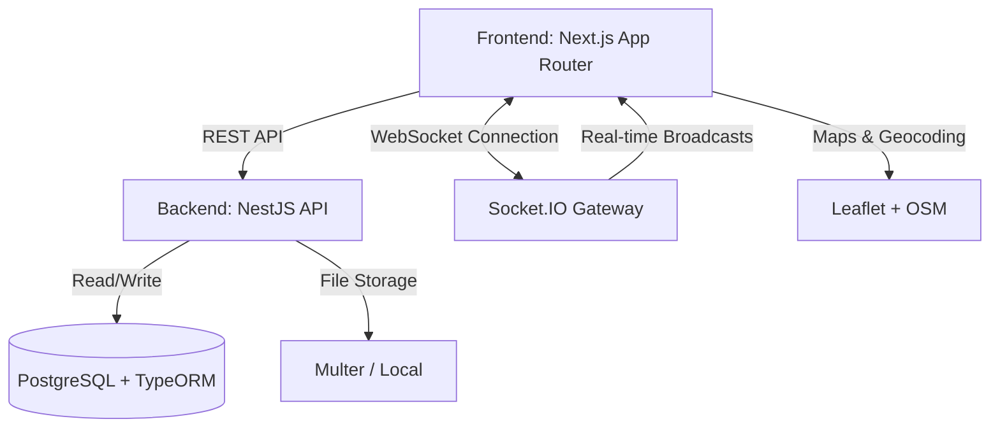
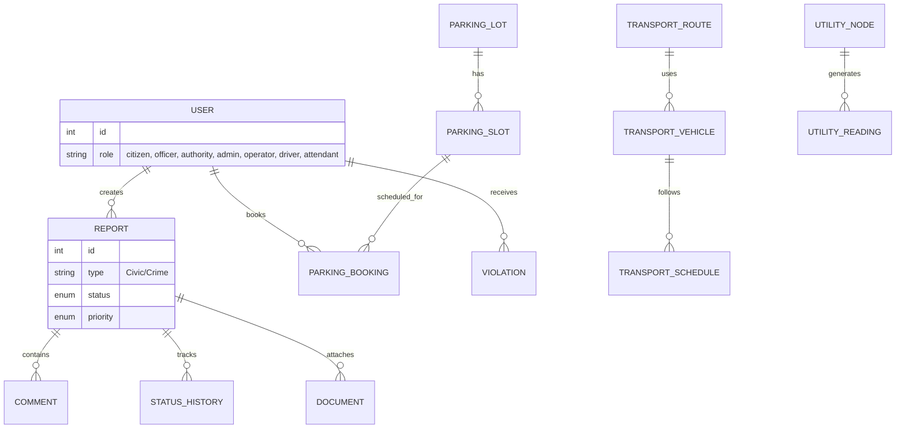

# Smart City Ecosystem - Complete System Design

This document provides a comprehensive overview of the architecture, tech stack, database schema, and core modules of the fully expanded Smart City platform.

---

## 1. High-Level Architecture

The system follows a modern **Client-Server Architecture** utilizing a decoupled frontend and backend, communicating via REST APIs and robust WebSockets (Socket.IO) for real-time capabilities across multiple city domains.



---

## 2. Technology Stack

### Frontend (Client-Side)
*   **Framework:** Next.js 15 (React App Router)
*   **Styling:** Tailwind CSS (with Dark/Light Mode theming)
*   **Animations:** Framer Motion
*   **Maps & Geolocation:** Leaflet.js (`react-leaflet`)
*   **State Management:** React Hooks (`useState`, `useEffect`)
*   **HTTP Client:** Axios (`api` instance with JWT interceptors)
*   **Data Visualization:** Recharts for admin analytics

### Backend (Server-Side)
*   **Framework:** NestJS (Node.js)
*   **Database ORM:** TypeORM
*   **Database Engine:** PostgreSQL
*   **Authentication:** JWT (JSON Web Tokens) & bcrypt
*   **File Uploads:** Multer (Evidence / Proof Uploads)
*   **Real-Time:** WebSockets (`@nestjs/websockets` + Socket.IO)
*   **Email Engine:** `@nestjs-modules/mailer` + Nodemailer

---

## 3. Database Schema Overview



*(Note: The database has expanded natively to support multiple ecosystems including Transport, Utilities, and Parking.)*

---

## 4. Core Ecosystems & Features

### 4.1 Global Authentication & Authorization
*   **JWT-Based Auth:** Secure unified login.
*   **Expanded RBAC (Role-Based Access Control):**
    *   `Citizen`: Submits reports, books parking, views public transit maps.
    *   `Field Officer`: Handles civic/crime assignments, updates resolutions.
    *   `Authority`: Triages issues, manages zones, and dispatches officers.
    *   `Attendant`: Validates parking bookings and on-ground operations.
    *   `Driver`: Manages transit vehicle locations and trip statuses.
    *   `Operator`: Manages transport routes, fleets, and fare structures.
    *   `Admin`: Full system control, SLA tracking, and macro-analytics.

### 4.2 Issue Reporting & Crime Management
*   **Multimedia Reporting:** Upload images/PDFs with coordinates.
*   **Smart Dispatch System:** Algorithmic assignment of officers based on proximity and load.
*   **Audit Trail & Public Transparency:** Public portal for civic transparency and anonymous crime tracking.

### 4.3 Smart Parking Ecosystem
*   **Real-Time Lot Management:** Live tracking of slot availability.
*   **Bookings & Payments:** End-to-end reservation system.
*   **Violations:** Enforcement portal for attendants.

### 4.4 Transport & Transit System
*   **Fleet Management:** Intercity and intracity scheduling.
*   **Live Tracking:** GPS updates feeding into citizen maps.
*   **Fare Logic:** Dynamic multi-tier pricing support.

### 4.5 Civic Utility Management
*   **Water & Electricity Grids:** Dashboards tracking pressure, consumption, and grid status.
*   **Gas (LPG):** Safe distribution tracking and inventory monitoring.

### 4.6 Real-Time Notification Engine
*   **WebSockets (Socket.IO):** Instant live updates on Authority dashboards when reports arrive.
*   **Email Dispatch:** Automated alerts on critical status changes.

---

## 5. Project Directory Structure

```text
smart-city-mvp/
├── backend/
│   ├── src/
│   │   ├── auth/              # JWT Strategies, Guards, Auth Controller
│   │   ├── categories/        # Report & Civic Categories mapping
│   │   ├── common/            # Global filters, pipes, and interceptors
│   │   ├── documents/         # Multer configuration and File Upload endpoints
│   │   ├── electricity/       # Power Grid status logic
│   │   ├── gas/               # LPG Utility management endpoints
│   │   ├── gateway/           # Socket.IO WebSocket endpoints & rooms
│   │   ├── locations/         # Location entities
│   │   ├── notifications/     # Mailer service and Handlebars templates
│   │   ├── parking/           # Parking Lots, Slots, and Bookings Engine
│   │   ├── reports/           # Issue & Crime Reporting Engine (CRUD, status)
│   │   ├── transport/         # Vehicles, Routes, Fare Models, Schedules
│   │   ├── users/             # Centralized User management & Profiles
│   │   ├── water/             # Water Utility Dashboard Logic
│   │   ├── zones/             # City Zone management and authority mapping
│   │   ├── app.module.ts      # Main application module
│   │   ├── main.ts            # NestJS entry point
│   │   ├── seed.ts            # Database seeder for core roles and reports
│   │   └── seed-parking.ts    # Database seeder for parking logic
│   └── uploads/               # Local physical storage for media evidence
│
└── frontend/
    ├── src/
    │   ├── app/
    │   │   ├── admin/           # Admin macro-analytics and user management
    │   │   ├── attendant/       # Parking ground operations & validation
    │   │   ├── authority/       # Command center (Issues, Triage, Dispatch)
    │   │   ├── book/            # Smart Parking slot reservation flow
    │   │   ├── bookings/        # User's active parking bookings
    │   │   ├── dashboard/       # General overview routing
    │   │   ├── driver/          # Transit execution and trip status portal
    │   │   ├── electricity/     # Public/Admin electricity utility dashboard
    │   │   ├── find/            # Public interfaces for finding utilities/parking
    │   │   ├── forgot-password/ # Password recovery flow
    │   │   ├── gas/             # Public/Admin LPG utility dashboard
    │   │   ├── login/           # Unified authentication gateway
    │   │   ├── lots/            # Parking lot browsing
    │   │   ├── map/             # Global live transit & issue map interface
    │   │   ├── officer/         # Field task management (Receive & Resolve)
    │   │   ├── operator/        # Fleet & Transport scheduling portal
    │   │   ├── parking/         # Citizen smart parking hub
    │   │   ├── payments/        # Payment processing gateways
    │   │   ├── profile/         # User profile management
    │   │   ├── register/        # Unified role-aware registration
    │   │   ├── reports/         # Citizen issue tracking & submission
    │   │   ├── reset-password/  # Password reset callback
    │   │   ├── transparency/    # Public analytics and open data portals
    │   │   ├── transport/       # Public Transit tracker & schedules
    │   │   ├── utilities/       # Aggregated public utility status
    │   │   ├── vehicles/        # Transport vehicle management
    │   │   ├── violations/      # Parking & traffic violation tracking
    │   │   ├── water/           # Public/Admin water utility dashboard
    │   │   ├── globals.css      # Global Tailwind configuration & themes
    │   │   └── layout.tsx       # Root React layout containing providers
    │   └── components/          # Reusable UI (Leaflet, Framer Motion, Charts)
```

---

## 6. Detailed Subsystem Architectures

### 6.1 Request Lifecycle & Data Flow
Every REST API request follows a strict lifecycle governed by NestJS decorators and architectural patterns to ensure security and data integrity:

1.  **Incoming HTTP Request**: e.g., `POST /reports`
2.  **Global Middleware/Guards**: The `JwtAuthGuard` checks the `Authorization` header. If valid, it injects the user into the request context. `RolesGuard` ensures the user has the correct RBAC permission.
3.  **Validation Pipe**: `class-validator` DTOs intercept the payload. If the payload is invalid (e.g., missing coordinates), it automatically throws a `400 Bad Request`.
4.  **Controller**: Extracts the validated DTO and passes it to the corresponding Service layer.
5.  **Service (Business Logic)**: Performs core operations (e.g., algorithmic officer assignment, tracking logic, or utility calculation).
6.  **Repository (TypeORM)**: Executes the raw SQL against the PostgreSQL database.
7.  **Event Dispatch**: The service emits asynchronous events (e.g., `this.gateway.notifyAuthority()`) so the UI updates instantly without blocking the HTTP response.
8.  **Response**: Returns formatted JSON back to the Next.js client.

### 6.2 WebSocket (Socket.IO) Event Design
Real-time operations are powered by a room-based WebSocket topology, eliminating heavy polling overhead:
*   **Room Topology**: Clients join specific rooms based on their roles and zones upon connection.
    *   `authority_zone_<id>`: Authorities only receive alerts for their assigned territory.
    *   `admin_global`: Admins receive a firehose of critical alerts.
    *   `report_<id>`: Users subscribe to specific reports they are tracking.
*   **Key Event Topics**:
    *   `new_report`: Emitted to the `authority` room when a citizen files an issue.
    *   `status_updated`: Pushed to the report creator and relevant officers.
    *   `vehicle_location_update`: Emitted by transit driver devices to update the public map at `1Hz` frequency.
    *   `parking_slot_claimed`: Broadcasted when a booking is confirmed, updating live availability counters instantly.

### 6.3 Frontend Architecture & Data Fetching
*   **Next.js App Router**: Utilizes React Server Components (RSC) where possible to reduce bundle size and execute DB/API calls securely on the server.
*   **Client Boundaries**: Components requiring interactivity (Maps, Socket.IO clients, complex forms) use the `"use client"` directive.
*   **Unified API Client**: An `axios` instance intercepts all outgoing requests to automatically attach JWT Bearer tokens and gracefully handle 401 Unauthorized redirects via a centralized auth provider context.
*   **Dynamic Theming**: Tailwind CSS handles system/user-preference dark mode via native `dark:` variants mapped to CSS root variables.
